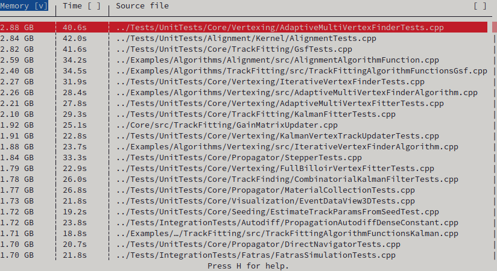
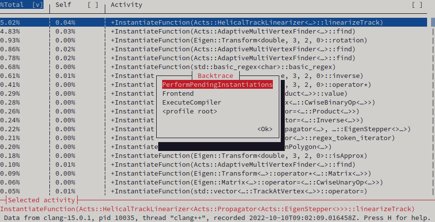

# crofiler: Easier C++ build profiling

<!-- Not published on crates.io yet!
[](https://crates.io/crates/crofiler)
[](https://docs.rs/crofiler/)
-->
[](https://github.com/HadrienG2/crofiler/actions?query=workflow%3A%22Continuous+Integration%22)


Understanding why C++ builds get slow and end up using a lot of RAM has become a
lot easier since `clang` introduced their `-ftime-trace` build tracing feature.

However, it is not easy enough yet because currently available `-ftime-trace`
visualizations (Chrome's `about:tracing` and to a lesser extent Speedscope)
remain too focused on the raw temporal sequence of activities that were
undertaken by `clang`, and not enough on actual build profiling questions such
as which source tres, C++ namespaces, individual class and function templates...
account for the highest share of expended compilation time.

`crofiler`, the **c**lang **C**++ **c**ompilation p**rofiler**, aims to provide
more immediate answers to such questions.


## What does this do?

On a suitably prepared build (more on this later), `crofiler` can measure and
display an overview of which compilation units take a lot of time to build or
use up a lot of RAM in the process.



For each compilation unit, a detailed hierarchical time profile can then be
measured and displayed, allowing quick insight on which codebase components
account for the highest share of compilation time.



Because there is a strong correlation between compilation time and memory
consumption, such time-based insight may also be used to optimize the memory
overhead of a C++ build.

Significant effort has been expended to keep the display readable even in the
presence of very long C++ type names, which are often seen in the presence of
popular build-hostile programming techniques like expression templates or
indiscriminate replacement of inheritance with templating.


## How do I use it?

### Prerequisites

#### Mandatory

At present, `crofiler` has only been tested on Linux. It is expected to be fully
functional on other Unices like macOS or FreeBSD, but not on Windows as it
currently relies on VT100 terminal commands.

To be able to profile compilation units, you will need a `clang` version newer
than 9 (to have the `-ftime-trace` feature) and otherwise suitable for building
your project.

Your build system also needs to be able to export a
[JSON compilation database](https://clang.llvm.org/docs/JSONCompilationDatabase.html).
We will assume usage of CMake in the remainder of this tutorial, which can do
this, otherwise please refer to your build system's manual.

You will also need a recent [Rust toolchain](https://www.rust-lang.org/learn/get-started)
in order to build `crofiler` from source.

### Installing `crofiler`

The `crofiler` codebase is currently too fast-moving for binary distribution to
make sense. Therefore, we currently advise building `crofiler` from source code.
You can do it as follows:

```bash
git clone https://github.com/HadrienG2/crofiler.git
cd crofiler
cargo install --path .
```

### Profiling your build

Make sure all the utilities mentioned are in your `PATH`, then export a
compilation database for your build. With CMake, that is done by re-running your
`cmake` configuration command with the `-DCMAKE_EXPORT_COMPILE_COMMANDS=ON`
option.

Then, in your build directory, run `crofiler` as you would run `make` or
`ninja`, and a TUI wizard will walk you through the next steps. If you find
any message or interaction to be hard to understand, please report this as a bug.

Also, please note that due to the technical constraints of textual user
interfaces, most warnings and error messages of unbounded verbosity are emitted
over `syslog`. In `systemd`-based Linux distributions, you can monitor them by
setting up a separate terminal with this command:

```bash
journalctl -f
```


## Anything else?

The algorithm used to simplify C++ entity names can also be used via a separate
standalone utility called `simpp`, which you can install like so:

```bash
cd /path/to/crofiler/simpp
cargo install --path .
```

It is subsequently usable by specifying the number of terminal columns you want
via the `--cols` flag, abbreviated as `-c`. For example, this command...

```bash
simpp -c80 'Acts::EigenStepper<Acts::StepperExtensionList<Acts::detail::GenericDefaultExtension<double> >, Acts::detail::VoidAuctioneer>::step<Acts::Propagator<Acts::EigenStepper<>, Acts::Navigator>::State<Acts::PropagatorOptions<Acts::ActionList<ActsFatras::detail::SimulationActor<std::mersenne_twister_engine<long unsigned int, 32, 624, 397, 31, 2567483615, 11, 4294967295, 7, 2636928640, 15, 4022730752, 18, 1812433253>, ActsFatras::NoDecay, ActsFatras::InteractionList<ActsFatras::ContinuousProcess<ActsFatras::detail::ScatteringImpl<ActsFatras::detail::Highland>, ActsFatras::ChargedSelector, ActsFatras::EveryParticle, ActsFatras::EveryParticle>, ActsFatras::ContinuousProcess<ActsFatras::BetheBloch, ActsFatras::ChargedSelector, ActsFatras::Min<ActsFatras::Casts::P>, ActsFatras::EveryParticle>, ActsFatras::ContinuousProcess<ActsFatras::BetheHeitler, ActsFatras::AbsPdgSelector<(Acts::PdgParticle)11>, ActsFatras::Min<ActsFatras::Casts::P>, ActsFatras::Min<ActsFatras::Casts::P> > >, (anonymous namespace)::HitSurfaceSelector> >, Acts::AbortList<ActsFatras::detail::SimulationActor<std::mersenne_twister_engine<long unsigned int, 32, 624, 397, 31, 2567483615, 11, 4294967295, 7, 2636928640, 15, 4022730752, 18, 1812433253>, ActsFatras::NoDecay, ActsFatras::InteractionList<ActsFatras::ContinuousProcess<ActsFatras::detail::ScatteringImpl<ActsFatras::detail::Highland>, ActsFatras::ChargedSelector, ActsFatras::EveryParticle, ActsFatras::EveryParticle>, ActsFatras::ContinuousProcess<ActsFatras::BetheBloch, ActsFatras::ChargedSelector, ActsFatras::Min<ActsFatras::Casts::P>, ActsFatras::EveryParticle>, ActsFatras::ContinuousProcess<ActsFatras::BetheHeitler, ActsFatras::AbsPdgSelector<(Acts::PdgParticle)11>, ActsFatras::Min<ActsFatras::Casts::P>, ActsFatras::Min<ActsFatras::Casts::P> > >, (anonymous namespace)::HitSurfaceSelector>::ParticleNotAlive, Acts::EndOfWorldReached, Acts::PathLimitReached> > > >(Acts::Propagator<Acts::EigenStepper<Acts::StepperExtensionList<Acts::detail::GenericDefaultExtension<double> >, Acts::detail::VoidAuctioneer>, Acts::Navigator>::State<Acts::PropagatorOptions<Acts::ActionList<ActsFatras::detail::SimulationActor<std::mersenne_twister_engine<unsigned long, 32, 624, 397, 31, 2567483615, 11, 4294967295, 7, 2636928640, 15, 4022730752, 18, 1812433253>, ActsFatras::NoDecay, ActsFatras::InteractionList<ActsFatras::ContinuousProcess<ActsFatras::detail::ScatteringImpl<ActsFatras::detail::Highland>, ActsFatras::ChargedSelector, ActsFatras::EveryParticle, ActsFatras::EveryParticle>, ActsFatras::ContinuousProcess<ActsFatras::BetheBloch, ActsFatras::ChargedSelector, ActsFatras::Min<ActsFatras::Casts::P>, ActsFatras::EveryParticle>, ActsFatras::ContinuousProcess<ActsFatras::BetheHeitler, ActsFatras::AbsPdgSelector<(Acts::PdgParticle)11>, ActsFatras::Min<ActsFatras::Casts::P>, ActsFatras::Min<ActsFatras::Casts::P> > >, (anonymous namespace)::HitSurfaceSelector> >, Acts::AbortList<ActsFatras::detail::SimulationActor<std::mersenne_twister_engine<unsigned long, 32, 624, 397, 31, 2567483615, 11, 4294967295, 7, 2636928640, 15, 4022730752, 18, 1812433253>, ActsFatras::NoDecay, ActsFatras::InteractionList<ActsFatras::ContinuousProcess<ActsFatras::detail::ScatteringImpl<ActsFatras::detail::Highland>, ActsFatras::ChargedSelector, ActsFatras::EveryParticle, ActsFatras::EveryParticle>, ActsFatras::ContinuousProcess<ActsFatras::BetheBloch, ActsFatras::ChargedSelector, ActsFatras::Min<ActsFatras::Casts::P>, ActsFatras::EveryParticle>, ActsFatras::ContinuousProcess<ActsFatras::BetheHeitler, ActsFatras::AbsPdgSelector<(Acts::PdgParticle)11>, ActsFatras::Min<ActsFatras::Casts::P>, ActsFatras::Min<ActsFatras::Casts::P> > >, (anonymous namespace)::HitSurfaceSelector>::ParticleNotAlive, Acts::EndOfWorldReached, Acts::PathLimitReached> > > &) const'
```

...would output this result:

```
Acts::EigenStepper<…>::step<…::State<…>>(…) const
```

Output from `stdin` is also accepted, which can be convenient when an entity
name is very long or contains single quotes. For example, assuming an
`entity.txt` file containing a C++ entity name is present in the working
directory, this command would work:

```bash
simpp -c80 <entity.txt
```

Any C++ entity name emitted by `clang` should be supported by this utility, so
if you find an entity name that doesn't simplify correctly, please report it as
a bug.
